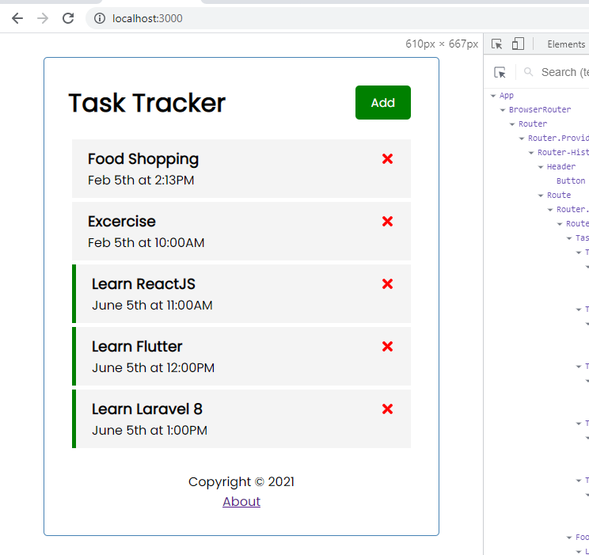

# Hello World - React

Project ini adalah Mini Project untuk tujuan pembelajaran library front-end yang paling populer yaitu "React". Mini project ini memilik skenario aplikasi untuk mengelola ToDo list / manajemen tugas. Pembelajaran ini mengikuti tutorial berdurasi 1 jam dari Traversy Media oleh Brad dari awal sampai selesai.

Link Tutorial > [ReactJS Crash Course by Traversy Media](https://www.youtube.com/watch?v=w7ejDZ8SWv8&t=5468s)

Berikut sedikit screenshot dari mini project ini:


## Informasi Awal

### Apa yang saya pelajari?

ReactJS dikembangkan oleh facebook yang tujuan dibuatnya adalah untuk mempermudah pengelolaan project pemrograman di sisi Front-End. Industri Web Internet raksasa seperti Facebook, Instagram, Whatsapp menggunakan library ini.

Fundamental cara pemrograman dari ReactJS ini adalah <i>Component Based</i> yaitu mengkonstruksi desain halaman website (UI & UX) dari bagian-bagian komponen kecil yang digabungkan menjadi satu kesatuan halaman web. Saya mendapati fundamental seperti ini mirip dengan pemrograman mobile seperti di bagian XML Android Studio.

Tentunya, masih banyak yang harus saya pelajari lagi untuk ReactJS ini. 

### Gambaran awal aplikasi web

Mini project ini menggunakan server dari dukungan [Json Server](https://www.npmjs.com/package/json-server)  yang menyediakan data antrian Tugas yang harus dikerjakan dalam bentuk JSON yang kemudian di ambil oleh ReactJS dan ditampilkan pada komponen-komponen yang dibuat.

Pada aplikasi React ini, juga dilakukan tambah, edit dan hapus data Tugas untuk mensimulasikan bagaimana ReactJS ini dapat berinterasi Back-End. Kunci utamanya adalah dengan adanya fungsi `fetch()` bawaaan dari ReactJS

### Teknologi yang digunakan
* [ReactJS](https://reactjs.org/)
* [Json Server](https://www.npmjs.com/package/json-server)


## Cara menggunakan

Untuk menjalankan aplikasi, anda harus menjalankan JsonServer sebagai BackEndnya dan react development server-nya. Anda bisa menjalankan keduanya menggunakan script `npm` seperti ini
```SH
npm run server
npm run start
```
Script NPM tersebut akan menjalankan server BackEnd penyedia REST API database JSONServer di `localhost:5000` dan anda dapat menjalankan aplikasi reactnya di 
```SH
http://localhost:3000
```

## Contact

Badar Wildanie <br/>
* [WA](https://wa.me/+6282228111059?text=Halo,%20tadi%20saya%20liat%20project%20react%20di%20github%20anda) <br/> 
* [IG - @badar.wildanie](https://www.instagram.com/badar.wildanie/) <br/>
* [Facebook - Muhammad Wildanie](facebook.com/badar.wildanie) <br/>
* [GitHub - wildanie12](https://github.com/wildanie12)